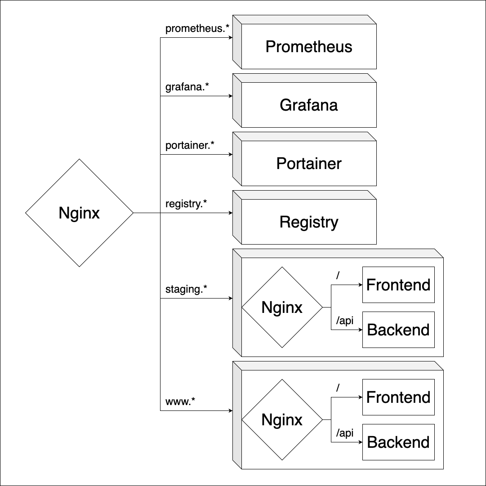
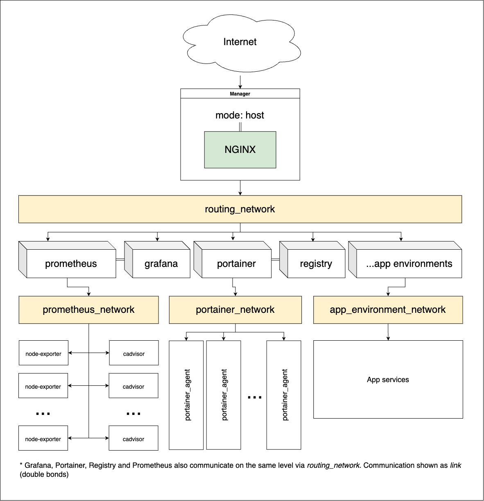

# Docker Swarm Boilerplate

Some short description TBD

## Features

### Multiple environments and scalability

It goes with two subdomain-environments preconfigured, yet the architecture poses no limitation on the number of environments.

### Simple setup

Quick and straightforward install: initial configuration takes a few minutes, no bash scripts involved.

### NoOps

Everything is contained in Docker containers managed by Swarm. It doesn't need additional maintenance to run.

### Limited exposure

Due to the application's limited exposure, there are few security concerns. Services are not exposed to the public network and all external calls are routed through a single Nginx reverse proxy.

### Just the topic, nothing else.

The boilerplate contains all the necessary tools:

- a private registry;

- an instance of Portainer to manage and deploy services;

- a monitoring stack combining Prometheus, cAdvisor, Node Exporter, and Grafana;


## System design

### Routing



### Networking



## Install

### Prerequisites

- Ubuntu 20 LTS
- sudo access

### SSL Certificate acquisition

TBD

### Cluster setup

#### Manager node

Install Docker:
```shell
curl -fsSL get.docker.com -o get-docker.sh && \
CHANNEL=stable sh get-docker.sh && \
rm get-docker.sh
```

Get your kernel name:
```shell
uname -s
```

Get your architecture:
```shell
uname -m
```

Replace `<dist>` with your kernel name and `<arch>` with your architecture and install Docker Compose:
```shell
sudo curl -L "https://github.com/docker/compose/releases/latest/download/docker-compose-<dist>-<arch>"  -o /usr/local/bin/docker-compose  && \
sudo mv /usr/local/bin/docker-compose /usr/bin/docker-compose && \
sudo chmod +x /usr/bin/docker-compose
```

Start the swarm and save advertised address to join worker nodes:
```shell
docker swarm init
```

#### Worker nodes

Install Docker:
```shell
curl -fsSL get.docker.com -o get-docker.sh && \
CHANNEL=stable sh get-docker.sh && \
rm get-docker.sh
```

Join the swarm replacing the `<token>` and `<ip>` with values provided during the manager setup
```shell
docker swarm join --token <token> <ip>
```

### Environment variables setup

```shell
# App domain name (without www, slashes or scheme)
export APP_DOMAIN=notifio.io

# An arbitrary string to tag app's images  
export APP_VERSION=0.1.0-beta

# App dev VPN IP address
export APP_DEV_VPN_ADDRESS=1.1.1.1

# 
export APP_CERTS_HOST_LOCATION=/etc/letsencrypt

#
export APP_CERTS_CONTAINER_LOCATION=/etc/letsencrypt

# Including APP_CERTS_CONTAINER_LOCATION
export APP_CERTIFICATE_PATH=${APP_CERTS_CONTAINER_LOCATION}/live/notifio.io/fullchain.pem

# Including APP_CERTS_CONTAINER_LOCATION
export APP_CERTIFICATE_KEY_PATH=${APP_CERTS_CONTAINER_LOCATION}/live/notifio.io/privkey.pem
```

### Application deployment

All commands to be executed from manager node.

#### Infra stack and monitoring stacks

Clone the repository and open the project:
```shell
git clone https://github.com/mikhail-ev/notifio.io.git
cd notifio.io # TODO change
```

Create a routing network:
```shell
docker network create -d overlay routing
```

Replace `user` and `passwd` with your username and password and generate htpasswd file for the registry:
```shell
docker run -v /root/registry:/root/registry --entrypoint htpasswd httpd:2 -Bbc /root/registry/htpassword user passwd
```

Deploy the infra stack:
```shell
docker stack deploy --compose-file stacks/infra/docker-compose.yml infra
```

Deploy the monitoring stack:
```shell
docker stack deploy --compose-file stacks/monitoring/docker-compose.yml monitoring
```

Replace the `username` and `password` with the credentials you used to generate htpasswd file and login to registry:
```shell
docker login -u username -p password registry.notifio.io
```

#### Application stacks

Open the application stack in the shell:
```shell
cd stacks/app
```

Set the app's version:
```shell
export APP_VERSION=0.0.1-beta
```

Build docker images:
```shell
docker compose build
```

Push docker images:
```shell
docker compose push
```

Now, deploy the staging stack:
```shell
docker stack deploy --compose-file docker-compose.yml --with-registry-auth staging
```

And deploy the production stack:
```shell
docker stack deploy --compose-file docker-compose.yml --with-registry-auth production
```

## Usage

### Portainer registry provision

TBD

## Roadmap and TODOs

### Roadmap

TBD

### TODOs

- [ ] Split `staging` env into multiple on-demand environments of the second level
- [ ] Set consistent naming among networks
 